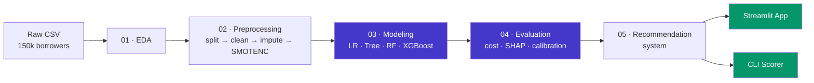

<div align="center">

# 🏦 Credit Risk Assessment

### Calibrated, cost-optimal credit default prediction — from raw data to a deployed decision system

<p>


</p>

<p>
<b>Test ROC-AUC 0.869</b> &nbsp;·&nbsp; <b>Calibrated probabilities</b> &nbsp;·&nbsp; <b>Cost-driven thresholds</b> &nbsp;·&nbsp; <b>SHAP reason codes</b>
</p>

</div>

---

> **TL;DR** — A full machine-learning pipeline that predicts whether a loan applicant will default within two years, trained on the Kaggle *"Give Me Some Credit"* dataset (150,000 borrowers). It compares four models, fixes their probability **calibration**, converts probabilities into **cost-optimal lending decisions**, and explains every prediction with **SHAP**. Two front-ends ship on top: an interactive **Streamlit dashboard** and a **command-line scorer**.

---

## 📑 Table of Contents

- [Overview](#-overview)
- [Why This Problem Matters](#-why-this-problem-matters)
- [Results at a Glance](#-results-at-a-glance)
- [The Pipeline](#-the-pipeline)
- [Methodology Highlights](#-methodology-highlights)
- [Tech Stack](#️-tech-stack)
- [Project Structure](#-project-structure)
- [Getting Started](#-getting-started)
- [The Web App](#️-the-web-app)
- [The Notebooks](#-the-notebooks)
- [Design Decisions & Trade-offs](#-design-decisions--trade-offs)
- [References](#-references)
- [Author](#-author)

---

## 🎯 Overview

Financial institutions face an asymmetric decision: **approving** a borrower who later defaults causes a direct capital loss, while **rejecting** a creditworthy borrower forfeits revenue. These two errors do **not** cost the same — and that asymmetry shapes every choice in this project.

The system answers one question: *given an applicant's financial profile, what is the probability they default within two years, and what is the cost-optimal decision?*

It does so end-to-end:

```
Raw data ──▶ EDA ──▶ Leakage-safe preprocessing ──▶ 4 models + tuning
   ──▶ Evaluation (discrimination · cost · SHAP · calibration)
   ──▶ Deployment (Streamlit dashboard + CLI scorer)
```

---

## 💡 Why This Problem Matters

Access to credit is one of the strongest predictors of economic mobility. A **well-calibrated** model protects the lender *and* ensures creditworthy people are not unfairly turned away. This dual objective — protect the lender, serve the borrower — is why the project treats **probability calibration** and **cost-sensitive thresholds** as first-class concerns rather than afterthoughts.

---

## 📊 Results at a Glance

**Discrimination on the untouched test set (30,000 borrowers):**

| Model | ROC-AUC | Gini | PR-AUC | KS |
|---|:--:|:--:|:--:|:--:|
| **XGBoost** ⭐ | **0.869** | **0.737** | **0.400** | **0.580** |
| Random Forest | 0.866 | 0.732 | 0.390 | 0.576 |
| Logistic Regression | 0.859 | 0.717 | 0.385 | 0.560 |
| Decision Tree | 0.857 | 0.714 | 0.362 | 0.574 |

> The class is heavily imbalanced (≈ 6.7 % default rate), so **ROC-AUC / PR-AUC** are used instead of accuracy — a model that predicts "no default" for everyone would be 93 % accurate and 100 % useless.

**Final deployed model — XGBoost + Isotonic calibration @ Bayes-optimal threshold p\* = 0.167:**

<div align="center">

| Metric | Value |
|---|:--:|
| Calibration method | Isotonic (chosen on a **validation set**) |
| Default-class recall | **0.59** |
| Default-class precision | 0.35 |
| Total business cost (C_FN=5, C_FP=1) | **6,275** |
| ROC-AUC after calibration | 0.869 *(unchanged — calibration is monotone)* |

</div>

---

## 🔄 The Pipeline



---

## 🔬 Methodology Highlights

What separates this from a "fit-predict-done" notebook:

- **🔒 Leakage-safe by construction** — the train/test split happens *before* any parameter is learned. Winsorisation caps, imputation medians and SMOTENC oversampling are derived from training data only, with SMOTENC running **inside** each CV fold.
- **⚖️ Cost-sensitive decisions** — instead of the default 0.5 cut-off, the threshold comes from the Bayes-optimal rule `p* = C_FP / (C_FN + C_FP)`, derived from an explicit business cost matrix.
- **🎯 Probability calibration done right** — raw cost-sensitive models are over-confident. Isotonic vs. Platt scaling is compared and the winner is selected on a dedicated **validation split** (never the test set), then re-fit on the full training data. ROC-AUC is provably unchanged.
- **🔍 Explainability** — every score ships with **SHAP reason codes**: which factors raised the risk, which lowered it, and by how much (in log-odds). Essential for a regulated lending context (ECOA, GDPR right to explanation).
- **📈 Scorecard scaling** — calibrated probabilities are mapped to an industry-style points score (PDO = 20, base 600 at 50:1 odds).

---

## 🛠️ Tech Stack

**Core ML**


**Data & Viz**


**App & Tooling**


---

## 📁 Project Structure

```
credit-risk-assessment/
│
├── notebooks/                          # The analysis, in execution order
│   ├── 01_eda.ipynb                    # Profiling, missing values, class imbalance
│   ├── 02_preprocessing.ipynb          # Split → clean → impute → winsorize → SMOTENC
│   ├── 03_modeling.ipynb               # 4 models, imbalance strategies, CV tuning
│   ├── 04_evaluation.ipynb             # Discrimination · cost · SHAP · calibration
│   └── 05_recommendation_system.ipynb  # Reconstructable serving + decision policy
│
├── src/
│   └── utils.py                        # Single source of truth for inference logic:
│                                       #   feature contract · CreditPreprocessor ·
│                                       #   DecisionPolicy · scorecard · scoring
│
├── streamlit_app.py                    # Interactive dashboard (scoring + analytics)
├── app.py                              # Command-line applicant scorer
│
├── .streamlit/config.toml              # Pinned light theme for the dashboard
├── requirements.txt                    # Exact, version-pinned dependencies
└── README.md
```

> **Note:** `data/` and the trained `*.joblib` artifacts are intentionally **not** committed (`.gitignore`). They regenerate by running the notebooks in order.

---

## 🚀 Getting Started

### 1. Clone & set up the environment

```bash
git clone https://github.com/stivanpashaliev/credit-risk-assessment.git
cd credit-risk-assessment

python -m venv .venv
# Windows
.venv\Scripts\activate
# macOS / Linux
source .venv/bin/activate

pip install -r requirements.txt
```

### 2. Add the dataset

Download the [**Give Me Some Credit**](https://www.kaggle.com/c/GiveMeSomeCredit) dataset from Kaggle and place `cs-training.csv` in:

```
data/cs-training.csv
```

### 3. Run the notebooks **in order**

```bash
jupyter lab
```

Run `01 → 02 → 03 → 04 → 05`. This regenerates the processed data and the trained model artifacts that the apps depend on.

### 4. Launch the dashboard

```bash
streamlit run streamlit_app.py
```

Open **http://localhost:8501**.

---

## 🖥️ The Web App

The Streamlit interface has two tabs, built for **two different audiences**:

### 🧾 Applicant decision — for a loan officer
- Live **Approve / Manual Review / Decline** verdict with calibrated probability
- **Credit score** (scorecard points) and the lower-cost action
- **Risk meter** showing the applicant against the policy thresholds
- **SHAP reason codes** — the exact factors driving *this* decision

### 📈 Portfolio risk view — for a credit analyst
- **Decision-policy simulation** — drag the cut-offs and watch the portfolio respond
- Approval / review / decline rates and **bad-rate-among-approved**
- **Business outcome matrix** across all three decision tiers
- **Cut-off trade-off** simulation and **score-separation** distribution
- *Collapsible* technical section (ROC, calibration) for model-risk reviewers

```bash
# Prefer the terminal? Score a single applicant interactively:
python app.py
```

---

## 📓 The Notebooks

| # | Notebook | What it does |
|:--:|---|---|
| 01 | **EDA** | Dataset profiling, missing-value patterns, class imbalance, and the ROC-AUC justification |
| 02 | **Preprocessing** | Stratified split *first*, anomaly cleaning (96/98 sentinels, `age==0`), median imputation, winsorisation, SMOTENC |
| 03 | **Modeling** | Logistic Regression, Decision Tree, Random Forest, XGBoost · imbalance-strategy comparison · `RandomizedSearchCV` |
| 04 | **Evaluation** | Discrimination metrics · cost-based threshold selection · SHAP interpretability · **leakage-free probability calibration** |
| 05 | **Recommendation system** | Faithful preprocessing reconstruction (`assert_frame_equal`), three-tier decision policy, persisted artifacts |

---

## 🧭 Design Decisions & Trade-offs

<details>
<summary><b>Why ROC-AUC over accuracy?</b></summary>

With a ~6.7 % default rate, accuracy is misleading — a constant "no default" prediction scores ~93 %. ROC-AUC and PR-AUC measure ranking quality across all thresholds, which is what a lender actually needs.
</details>

<details>
<summary><b>Why calibrate the probabilities at all?</b></summary>

Cost-sensitive training inflates the probability scale (the model becomes over-confident). The decisions in §7 rely on probabilities *meaning* what they say, so an isotonic map pulls the reliability curve back onto the diagonal — without changing the ranking (ROC-AUC is unchanged).
</details>

<details>
<summary><b>Why a validation set for choosing the calibration method?</b></summary>

Selecting Platt vs. isotonic on the test set would let the test set influence model configuration — a subtle leak. The project carves a validation split from the training data, selects there, and unlocks the test set **once**, for final reporting only.
</details>

<details>
<summary><b>Why is the recommendation system "faithful"?</b></summary>

Serving code that silently diverges from training preprocessing is a classic production bug. Notebook 05 reconstructs the transform and asserts it reproduces the frozen `X_test.csv` exactly — turning a quiet bug into a loud test failure.
</details>

---

## 📚 References

- Hastie, Tibshirani & Friedman — *The Elements of Statistical Learning*
- Chen & Guestrin (2016) — *XGBoost: A Scalable Tree Boosting System*
- Chawla et al. (2002) — *SMOTE: Synthetic Minority Over-sampling Technique*
- Lundberg & Lee (2017) — *A Unified Approach to Interpreting Model Predictions (SHAP)*
- Platt (1999) · Zadrozny & Elkan (2002) · Niculescu-Mizil & Caruana (2005) — calibration
- Siddiqi — *Credit Risk Scorecards*
- Dataset: [Kaggle — Give Me Some Credit](https://www.kaggle.com/c/GiveMeSomeCredit)

---

## 👤 Author

**Стивън Пашалиев**
· Computer Science · Machine Learning

<div align="center">

---

<sub>Demonstration model trained on a public Kaggle dataset. Not a real lending decision system.</sub>

</div>
